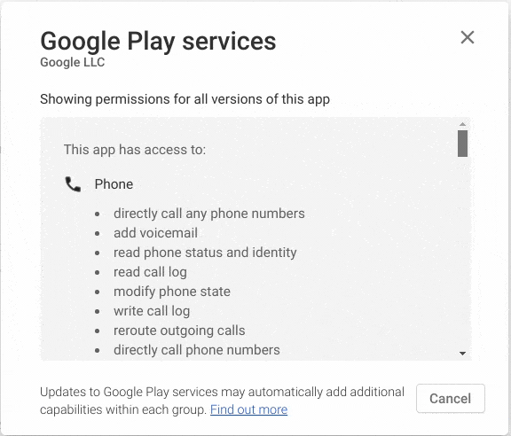

# Android without Google

The fact that **Google is detrimental to a person\'s privacy** is beyond any doubt. And therefore I have decided to stop feeding Google with my data and **to stop using Google at all**. But I do not want to change one big corp for another (yes, you Apple) so I was left with the only option to *degooglify* my Android phone.

This article is about how I have achieved that.

## The Goal

The objective is to have a phone as before (with as little compromises as possible) and simultaneously:

1. The phone is **not logged-in into Google** and **no app uses Google Account**.
2. There are **no [Google Play services](https://play.google.com/store/apps/details?id=com.google.android.gms)**.  
   Just go that link and **see permissions that that app by default** has.  
   *(You need to scroll down and click on the small link "View details" under the "Permission" section.)*

Permissions that are **by default** enabled for Google Play services.

## CalyxOS nad GrapheneOS

[CalyxOS](https://calyxos.org/) and [GrapheneOS](https://grapheneos.org/) and privacy focused Andoid OS. The limitaion is that both project **supports only Pixel phones**. But once my current phone dies, I will be definitely getting those.

As an alternattive, I have used LineageOS because it works on my current phone.

## LineageOS

The first step was to use an alternative Android system without integrated Google\'s spyware.

I choose [LineageOS](https://lineageos.org/) as it has a good reputation as a successor to the famous CyanogenMod. To install it, you need to find an up-to-date guide for your device and some skill with flashing your phone.

> **DISCLAIMER**: You can **brick your phone** if you mess it up! Bricked phone can be fixed but it\'s a lot of trial and error pain. If you have **OnePlus 7 Pro** [this guide (soft brick)](https://forum.xda-developers.com/oneplus-7-pro/how-to/rom-stock-fastboot-roms-oneplus-7-pro-t3931424) and [this guide (hard brick)](https://www.theandroidsoul.com/how-to-unbrick-a-dead-oneplus-7-pro/) can help a lot. Don\'t ask! 😂

In a nutshell, you need custom recovery [TWRP](https://twrp.me/), then [zip file](https://download.lineageos.org/) with LineageOS for your device and [fastboot+adb tools](https://forum.xda-developers.com/showthread.php?t=2588979) to install it.

### Upgrading LineageOS

LineageOS comes with auto-updates, but for major releases the upgrade needs to by done by loading new version via `adb`. It is however very simple by:

- downloading the [`zip` file](https://download.lineageos.org/) for given device
- installing `adb` by `sudo apt-get install android-tools-adb android-tools-fastboot`
- connecting the device, enabling root and do `adb root`

There is an [official guide](https://wiki.lineageos.org/devices/guacamole/upgrade) for it.

- - - - - -

## Getting Apps

Now we need some apps. Of course, we cannot use Google Play Store for obvious reasons.

### F-Droid is the new Google Play

Instead of Google Play, there is [F-Droid](https://f-droid.org/) as a main source of apps.

#### Browser

Let\'s start with the browser. I chose the [DuckDuckGo Privacy Browser](https://f-droid.org/en/packages/com.duckduckgo.mobile.android/) as my primary phone browser. If I need to stay logged intosome webpage, I use [Fennec](https://f-droid.org/en/packages/org.mozilla.fennec_fdroid/).

#### Contacts, Calendar, and Tasks (Todos)

Support for the calendar and contacts is hardcoded directly in Android itself. We just need to use some synchronization service other than the one from Google.

[DecSync CC](https://f-droid.org/en/packages/org.decsync.cc/) allows to have contacts, calendars, notes synchronized as files in any given directory. Synchronization of this directory can be done by other app (for example [Syncthing](https://syncthing.net/)).

To migrate the existing contacts and calendars you can use [this app](https://f-droid.org/en/packages/org.sufficientlysecure.ical/) (it's UI is little bit old-school, but it gets the job done).

For synchronization with external calendars there are:

- [ICSx5](https://f-droid.org/en/packages/at.bitfire.icsdroid/) for synchronization of ICS links and files (for example [Facebook Events](https://www.it-support.com.au/how-to-import-facebook-calendar-to-google-calendar-and-outlook/2018/03/))
- [DAVx5](https://f-droid.org/en/packages/at.bitfire.davdroid/) for synchronization of other accounts (for example corporate Google Account)

For tasks/todos I chose an app called simply [Tasks](https://f-droid.org/en/packages/org.tasks/). It can be synchronized over DecSync as well and easily replaces [Todoist](https://todoist.com/) (which won\'t run on the phone without Google play services).

As calendar app [Etar](https://f-droid.org/en/packages/ws.xsoh.etar/) is just great.

### Aurora as a Proxy to Google Play

But what if the app (or its alternative) is not available on F-Droid?

The solution to this problem is [Aurora](https://f-droid.org/en/packages/com.aurora.store/). It is a proxy store that allows you to download apps from Google Play Store without interacting with it directly. It uses an anonymous Google account to keep you safe. Naturally, it also means that you cannot buy or use already purchased paid apps. (There is an option to log in via your own Google account but that would completely compromise the goal of staying anonymous.)

More info about Aurora can be found on their [website](http://auroraoss.com/) and [GitLab](https://gitlab.com/AuroraOSS/AuroraStore).

Surprisingly, theose Google apps can be installed via Aurora and they work without Google play services:

- [Google Maps](https://play.google.com/store/apps/details?id=com.google.android.apps.maps&hl=en_us)
- [Google Translate](https://play.google.com/store/apps/details?id=com.google.android.apps.translate&hl=en_us)

Most other apps I regularly use also work. For example Revolut, Spotify, AirBnb, Booking, Travala, Trello, Disord, and Slack, they all work.

### Downloading Apps Directly

The last resort is to download the APK directly from a website and install the app manually.

> **WARNING**: Downloading APKs directly has HUGE security issues: **1) no updates** and **2) you may download malware APK**.

The only app I suggest installing this way is [Signal](https://signal.org/android/apk/) because it has **[self-update](https://github.com/signalapp/Signal-Android/commit/9b8719e2d56a098502475bb5b2295c7a376d4caa) and the** APK is **signed**. More info on this topic [here](https://github.com/signalapp/Signal-Android/issues/127).

- - - - - -

Sadly, there are still some apps left that we need to use but they are simply not programmed to work without Google play services.

## microG

[microG](https://microg.org/) is a replacement for proprietary Google Play services. The idea is to replace them with Open alternatives. However, there is a huge problem. To make it work you need to enable Signature Spoofing to be able to pretend, that your microG is Google Play services. And this poses a HUGE security threat and I have decided to not go this way. But if you are willing to try:

- There is [LineageOS Fork](https://lineage.microg.org/) with microG.
- [Here](https://lineage.microg.org/#faq6) is the explanation of why it is not supported by LineageOS directly.

## Compromises

Without Google Play services and without microG, some apps just don\'t work. I have written to developers of many of those apps, but most of them did not reply at all, and those who did provided none intention to fix it.

So I took the *"Improvise, Adapt, Overcome"* approach and I am slowly finding solutions and alternatives.

Here is the list of all the apps that I had to stop using because they have just stopped working:
- I have replaced [Settle Up](https://settleup.io/) with [Splitwise](https://www.splitwise.com/).

Some apps are not working on a de-googlified phone but they have good web interfaces that allow full usage.

- For [Uber](http://uber.com/) I use Uber\'s webpage.
- Instead of [Bolt](https://bolt.eu/) I use Uber\'s webpage.
- For [BlaBlaCar](https://www.blablacar.com/) I use the webpage.

More info about apps I find useful (that are available on F-Droid) can be found in [my previous article](../f-droid-you-dont-need-google-for-all-your-apps/f-droid-you-dont-need-google-for-all-your-apps.md).

## Conclusion

Long story short: **It works!** I have used the degooglified phone for a few months now and I live the same life as before. Some compromises were tough to make, but for the privacy that I have regained, it was definitely worth it.

## Sources

- [How to Use Android Without Google: Everything You Need to Know](https://www.makeuseof.com/tag/using-android-without-google/) (Google Play services are evil)
- [Reddit: Signal + F-Droid](https://www.reddit.com/r/signal/comments/9ae19b/signal_fdroid/e4urod2/)
- [How does Android feel without Google?](https://www.androidpit.com/android-without-google-apps) (Yalp Store)
- [Using Android without Google: A (Kind of) Guide](https://www.howtogeek.com/358166/using-android-without-google-a-kind-of-guide/) (MicroG)
- [GrapheneOS: Phone Privacy Protection](https://blog.lopp.net/grapheneos-phone-privacy-protection/amp/) (GrapheneOS, Aurora Store)
- [No More Google](https://nomoregoogle.com/) (Google products alternatives)
- [Wiki: Free Android](http://outcasts.referata.com/wiki/Free_Android)
- [Reddit: My F-Droid and anti big brother tools](https://www.reddit.com/r/fdroid/comments/heb59j/my_fdroid_and_anti_big_brother_tools/)
