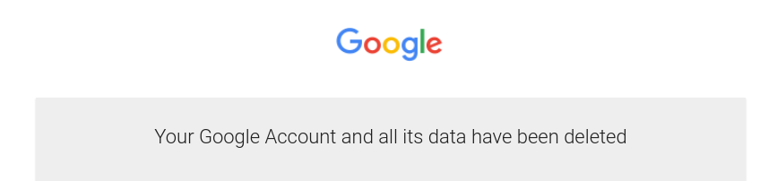

# De-Googlification

‒ *If it\'s free, **YOU** are the product.*

In this article, I describe my way of dealing with this problem in the context of Google and it\'s services.

For me, the deal (= my data for Google\'s services) was no longer acceptable and so I decided to stop using Google services where possible or use Google\'s product anonymously where I was not able to find an alternative.

Tthe word "De-Googlification" actually [exists](https://www.urbandictionary.com/define.php?term=De-Googlification) 🙃.

This **article describes my way, based on my use-cases** and my problems. **Your context may be different.** See the "Sources and references" chapter for more.

> **DISCLAIMER:** There is no affiliation between me and any service or app recommend in this article. I do so solely because I use them and I am happy with their product.

## Identity Provider (Login via Google)

This is an easy step to start with. The alternative here is to use a good old username and password. Using a password manager (like [KeePass](https://keepass.info/)) makes this practice secure without losing comfort.

## Authenticator

This one is simple as well. Several apps easily replace this service. I have chosen [Free OTP+](https://f-droid.org/en/packages/org.liberty.android.freeotpplus/) because it\'s open-source and is available on  [F-Droid](https://www.f-droid.org/) (Google Play store alternative with free and open-source applications).

Also the [KeepassXC](https://keepassxc.org) supports adding OTP into the database. See [FAQ about it](https://keepassxc.org/docs/#faq-security-totp) to understand security implications.

## Browser

For desktop I have completely switched to [Firefox](https://www.mozilla.org/en-US/firefox/new/). On Android I am using [DuckDuckGo Privacy Browser](https://f-droid.org/en/packages/com.duckduckgo.mobile.android/ and [Fennec F-Droid](https://f-droid.org/en/packages/org.mozilla.fennec_fdroid/) which is Firefox fork available on F-Droid.

Do not forget to enable [DNS over HTTPS](https://support.mozilla.org/en-US/kb/firefox-dns-over-https#w_manually-enabling-and-disabling-dns-over-https).

An important thing is to install those extensions for privacy.

Those are available for both desktop and mobile:

- [uBlock Origin](https://addons.mozilla.org/en-US/firefox/addon/ublock-origin/) (don\'t forget to enable cosmetic filters and filters for your country)
- [Privacy Badger](https://addons.mozilla.org/en-US/firefox/addon/privacy-badger17/)
- [HTTPS Everywhere](https://addons.mozilla.org/en-US/firefox/addon/https-everywhere/)
- [Decentraleyes](https://addons.mozilla.org/en-US/firefox/addon/decentraleyes/)
- [Bypass Paywalls](https://github.com/iamadamdev/bypass-paywalls-chrome/blob/master/README.md)
- [Cookie Autodelete](https://addons.mozilla.org/en-US/firefox/addon/cookie-autodelete/)

Those extensions are not available for the Android version:

- [Link Cleaner+](https://addons.mozilla.org/en-GB/firefox/addon/link-cleaner-plus/)
- [Firefox Multi-Account Containers](https://addons.mozilla.org/en-US/firefox/addon/multi-account-containers/)
- [Temporary Containers](https://addons.mozilla.org/en-US/firefox/addon/temporary-containers/)

## Search engine

The next step is migration to [DuckDuckGo Search](https://duckduckgo.com). It works quite well in 95% of cases. However, the loss of personalized search is quite a shock. I was able to embrace this change only after I have learned that I can fall back to Google adding `!g` to the search query. It makes you think twice before giving that query to Google but it\'s still easy enough to not make you any trouble.

Also there is [Startpage](https://startpage.com/) whis is said to be the proxy to Google without the spying.

## Cloud Drive

The best option is to self-host your data and keep them encrypted. One option is to have yur own [NAS](https://en.wikipedia.org/wiki/Network-attached_storage) but keepeing your data decetralized is even better (what if your house burns down or gets raided and you loose your NAS device). [Syncthing](http://syncthing.net/) solves this issue by interconnection all your devices and synchronizes data between them. To keep data at rest encrypted I have used [Cryptomator](https://cryptomator.org/).

However, this topic required its [own article](../independence-self-hosted-encrypted-file-sharing-backups/independence-self-hosted-encrypted-file-sharing-backups.md) where it is described in detail.

## Email

Next in a line is the email service. I replaced Gmail with [ProtonMail](https://protonmail.com). It has some minor UI issues in comparison with Gmail, but as I try to use email as little as possible it\'s not a big problem.

This change brings the challenge of changing an email at all accounts where Gmail was used.

This step takes some time and it is the most painful part of the De-Googlification process. I had to go through all accounts of all the important services that I use and had to replace the Google email with my ProtonMail email. I have also deleted a lot of no longer relevant accounts in the process.

## Maps

Google Maps are really hard to replace, but the important thing is, that they can be used without Google account and they [work on Android phones without Google Play services](../android-without-google/android-without-google.md#aurora-as-a-proxy-to-google-play).

I mainly use [OpenStreetMap](https://www.openstreetmap.org/) as an alternative with Android app [OsmAnd~](https://f-droid.org/en/packages/net.osmand.plus/) and I keep Google Maps only as a fallback.

## Video Sharing

For me replacing Youtube was in principle impossible. There are so many good content creators.

To disconnect myself from Google (to stop providing my data to Google) I replaced the Google Youtube app with [NewPipe](https://newpipe.schabi.org/). NewPipe is open-source available via [F-Droid](https://www.f-droid.org/). I have been using this app before because it supports audio-only video playing and video downloading. The final step was to just [export all subscriptions from Youtube](https://www.youtube.com/subscription_manager), import them to NewPipe, and then back up NewPipe export in Git.

Sadly, I was not able to find any useful alternative for the desktop. Hopefully, there [will be a NewPipe desktop app](https://github.com/TeamNewPipe/NewPipe/issues/1051) one day.

Last tip is [invidio.us](https://invidio.us/) a Youtube proxy allows you to browse videos even they are somehow restricted.

## Phone (OS)

De-Googlification of the Android phone is a bigger topic and deserved [its own article](../android-without-google/android-without-google.md).

## Calendar & Contacts

I realized, that I use a calendar exclusively from my phone and it is a very similar situation with my contact list. I need to access my contacts only from the phone, and I need browser/desktop access only as a backup solution.

I chose the [Etar](https://f-droid.org/en/packages/ws.xsoh.etar/) app and for data synchronization there are two options

1. [DecSync](https://github.com/39aldo39/DecSync) which synchronizes contacs and calendars into files that can be shared with [Syncthing](http://syncthing.net/). This solution is better because there is no third trusted party.
2. [EteSync](https://www.etesync.com/). For 2$ (of course, paid in Bitcoin) a month they offer end-to-end encrypted, tamper-proof journals to store contacts, calendars, and todos. EteSync also offers [web client](https://client.etesync.com/) so in some edge-case, I can access my data without my phone.

### External Calendars

[DAVx5](https://f-droid.org/en/packages/at.bitfire.davdroid/) can be used for synchronization with external Google Calendar (for example the company\'s).

- Guide how o set it up: [My client or employer forces me to use Google](../forced-google-at-work/forced-google-at-work.md)

[ICSx5](https://f-droid.org/en/packages/at.bitfire.icsdroid/) can be used for synchronization with external ICS links (for example [Facebook Events](https://www.it-support.com.au/how-to-import-facebook-calendar-to-google-calendar-and-outlook/2018/03/)).

## Translator / Language checker
Very good alternative to Google Translator is [DeepL](https://www.deepl.com). It has also the Android app. For languages that DeepL is not supporting, the Google Translator can be used anonymously and the mobile app works [without Google Play services](../android-without-google/android-without-google.md#aurora-as-a-proxy-to-google-play).

Some interesting projects in tthis fields are:
- [LanguageTool](https://languagetool.org/) is service similart to [Grammarly](https://www.grammarly.com/). But they have test-box on the main page that can be used for short checks.

## Docs

I use simply good old [LibreOffice](https://www.libreoffice.org/) and I synchronize my documents via [Syncthing](https://syncthing.net).

When I need to create a collaborative document I use [CryptPad](https://cryptpad.fr/). It offers quite a complete set of features, it is open-source and they claim zero-knowledge.

## Final step

And that\'s it. The last two steps are

- to [download](https://support.google.com/accounts/answer/3024190) and backup all your Google data,
- and finally, [delete your Google Account](https://support.google.com/accounts/answer/32046) for good 🎉.

## Conclusion

I was able to delete my Google account and disconnect myself from Google. I was also able to find an alternative solution to replace most of the Google services without sacrificing comfort. The only Google services I was not able to replace are Youtube, Translator, and partially Maps. For Youtube, the issue is that content creators stick to Youtube and unless they start to migrate to alternatives like [DTube](https://d.tube/) it won\'t be possible to stop using Youtube any time soon.

Translator covers nearly all languages and it is extremely easy to use. I was not able to find a suitable alternative. The best option I have found is [DeepL](https://www.deepl.com/) but it misses languages and also it has no Android app.

I still keep Maps mainly because of reviews and also as a backup for finding public transports in foreign cities.

## Sources and references

1. [NewPipe Issue on GitHub: Windows/Linux/Mac/Desktop Version?](https://github.com/TeamNewPipe/NewPipe/issues/1051)
2. [No More Google](https://nomoregoogle.com/)
3. [Alternatives to Google Products](https://restoreprivacy.com/google-alternatives/)
4. [Bitfire Forums: caldav sync with google doesnt work anymore](https://forums.bitfire.at/topic/1563/caldav-sync-with-google-doesnt-work-anymore/7)
5. [Reddit: Google Alternatives huge list restore your privacy](https://www.reddit.com/r/degoogle/comments/g1yu01/google_alternatives_huge_list_restore_your_privacy/)
6. [Degoogle Reddit](https://www.reddit.com/r/degoogle/)
