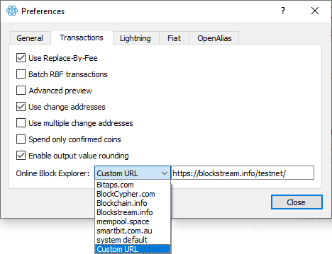
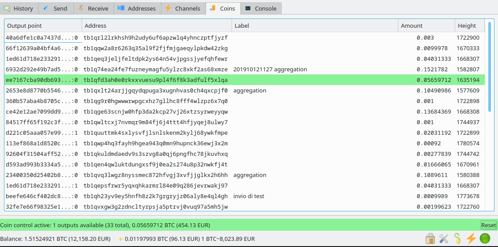

# Financially sovereign: Building the Bank

**The sovereign individual is not asking for permission** to store and transfer money. **The sovereign individual has funds in self-custody** and transfers them over the decentralized permissionless peer-to-peer network. No bank or government is interfering with the sovereign\'s individual finances.

## Bitcoin network access (Bitcoin full node)

To access the Bitcoin network without a middleman (= without asking for permission) we have to run our own full node and **became the very part of the network**. Why it is important is in in-depth explained [here [1]](https://en.bitcoin.it/wiki/Full_node#Why_should_you_use_a_full_node_wallet).

How to build and run bitcoin full node was in-detail covered in the previous article: [Sovereignty: Bitcoin Full Node (part&nbsp;1)](financiall-sovereign-bitcoin-full-node-part-1.md).

## Self custody (Wallet)

Self custody of Bitcoin means to hold our keys. *Not your keys, not your coins!* The sovereign individual does not rely on third-party honesty with his/her money and keeps the keys by himself/herself.

### Security

Keeping keys on internet-connected computers has a long history of lost/stolen funds. The best way to generate and store private keys is to use a [hardware wallet](https://en.bitcoin.it/wiki/Hardware_wallet).

1. Hardware wallet generates the [seed phrase](https://en.bitcoin.it/wiki/Seed_phrase) and **NEVER** share it on screen or via USB (the only exception is the backup).
2. A hardware wallet stores a private key (derived from the seed) and **NEVER** shares it on screen or via USB.
3. When we connect the hardware wallet to the computer the computer is only provided with information that allows it to **read** the wallet (how many Bitcoins are there) but **NEVER** to sign any transaction.
4. When we want to send Bitcoin, the computer composes the transaction and asks the hardware wallet to sign it. The wallet asks the user for confirmation and eventually signs the transaction. Then the signed transaction is sent back to the computer and broadcasted to the Bitcoin network.

### Backup keys

Hardware wallets can break, be lost, or be stolen and in that case, we need to have a backup. The [seed phrase](https://en.bitcoin.it/wiki/Seed_phrase) is the standard how to store information needed to recover the Bitcoin wallet.

> **NEVER type the seed phrase to any internet-connected device.** Always keep the seed phrase offline (written down on paper or stamped into the piece of stainless steel).

#### The problem

Ok, we have our offline backup, but how to safely store it?

1. How to protect it from loss or destruction?
2. How to protect it from theft?

We can have multiple copies to reduce the risk of loss and destruction, but it multiplies the risk of compromisation (we can have two copies in two different places, but if only one gets stolen, we lose all funds).

#### The solution

One solution to this is [Shamir\'s Secret Sharing](https://en.wikipedia.org/wiki/Shamir%27s_Secret_Sharing). It is an algorithm that splits secret into `n` shards and requires only `t` (where `t ≤ n`) to recover it. The hardware wallet [TREZOR T](https://shop.trezor.io/product/trezor-model-t) comes with the [Shamir Backup](https://trezor.io/shamir) that implements and [standardizes [2]](https://github.com/satoshilabs/slips/blob/master/slip-0039.md) the Shamir\'s Secret Sharing algorithm.

#### Threat model

The optimal number of shards (`n`), the size of the threshold (`t`), and who/where/how should keep individual shards, depend on our [threat model](https://en.wikipedia.org/wiki/Threat_model). **The threat model is something that everyone has to assess individually**, and there is no one-size-fits-all solution.

But here are some examples of questions that may be good to ask:

- How do I recover funds when my family turns against me?
- How do I recover funds when my friend turns against me?
- How do I recover funds when my house burns to the ground?
- How do I recover funds when there is a disaster affecting the whole region?
- How do I recover funds when all my possessions are seized (including bank vault)?
- How do I recover funds when I am forced to leave the country and never return (exile or evacuation)?
- How my heirs recover funds when I die?
- How my heirs recover funds when I die, and there is some crazy Bitcoin inheritance tax.

#### Setup Shamir Backup

To setup Shamir Backup on TREZOR T follow:

- a [step-by-step manual](https://wiki.trezor.io/User_manual:Creating_a_wallet_with_Shamir_Backup) on TREZOR wiki
- or [How & Why to Set Up a Shamir Backup on Trezor Model T](https://bitcoin-takeover.com/how-and-why-to-set-up-a-shamir-backup-trezor-model-t/) (by Vlad Costea)

> It is **ABSOLUTELY CRITICAL** to **test the backup**. Once you have your shards written down or put into steel: 1. Do the [dry-run recovery](https://blog.trezor.io/test-your-seed-backup-dry-run-recovery-df9f2e9889).
> 2. Send a small amount of BTC into the wallet, wipe TREZOR, recover it and check if the previously send amount is there.
> 
> **Make sure you have tested every shard at least once.** For example: If you have Shamir 3-of-5, you have to do all the above twice (for the first three shards and then for the last three shards).

(There is also [Super Shamir](https://wiki.trezor.io/Super_Shamir) that allows groups of shards. In other words, it is a nesting of multiple Shamir backups. More info [here](https://wiki.trezor.io/Super_Shamir) and [here](https://wiki.trezor.io/User_manual:Creating_a_wallet_with_Super_Shamir).)

### Storing the Shamir\'s shards

Paper is not a durable medium. It is a good start, but in the long term, a more permanent medium is needed. The market standard is stainless steel. It melts at 1375°C (different steel alloys have slightly [different melting point ranges](https://www.engineeringclicks.com/melting-point-of-steel/)) while housefire peaks around 704°C [[4]](https://jlopp.github.io/metal-bitcoin-storage-reviews/why).

Here is a great [review of many currently available products [3]](https://jlopp.github.io/metal-bitcoin-storage-reviews/) by Jameson Lopp.

Here are some important notes:

1. **Complexity is a weakness.** More parts mean more possible failures and the more complex is the setup the more mistakes can be made.
2. **Stamping by hand is annoying and easy to mess up** (in the case of five shards, we need to stamp 400 letters).
3. Shamir adds redundancy to protect the seed backup from random failures. However, if there is a **systematic flaw** in the backup design, it may still cause **systematic failure leading to the loss of too many shards and thus all funds**.
4. More Shamir shards require more steel gadgets, **adding to the price**. But it is important to realize, that we are **building the bank** to hold our life savings, and the security is **worth the price**.

This article suggests to:

1. **buy a steel solution** that is robust and simple to assemble like [Cryptosteel Capsule](https://cryptosteel.com/product/cryptosteel-capsule/).
2. **duplicate every shard on paper as well** and make sure the shard-holder stores the steel and paper in different locations
3. **consider the threat model carefully** and distribute shards according to it.

Here are some ideas to consider, but they **strongly depend on the threat model**

- We can ask a family member or best friend to hold one shard for us.
- We can put one shard in the bank\'s vault (this is their original purpose after all).
- Distribute shards over multiple jurisdictions may be a good idea in case we have to emigrate rather quickly.
- Being able to do the recovery in some reasonable time (for example 24h) may be a good idea.

### Best practices

1. It is important to **never hold multiple shards at once**. When doing recovery we should input shards one by one. TREZOR supports that and can be turned off between separate shard inputs.
2. **Distribute shards before moving funds in**.
3. **Backup recovery must be regularly tested** to check that all shards are still available and working. (The interval between those tests depends on shard distribution setup and the threat model).

> It is **ABSOLUTELY CRITICAL** to **test the backup** regularly by doing the whole round-trip to **validate that all shards are still available and working**.

## Moving funds privately and without asking for permission

The TREZOR software (both [webpage wallet](https://wallet.trezor.io) and [Suit for desktop](https://suite.trezor.io/)) have (at the time of the publishing of this article) those issues:

1. It is not possible to [connect them to the custom Bitcoin full node #2737](https://github.com/trezor/trezor-suite/issues/2737)
2. It is not possible to use [custom blockchain explorer #3211](https://github.com/trezor/trezor-suite/issues/3211).
3. They communicate with Satoshi Labs backend server (the only permissible connection should be to the specified Bitcoin full node).
4. [Coin-control is not implemented #2770](https://github.com/trezor/trezor-suite/issues/2770).

**Because of those issues, it is unfortunately not possible to use TREZOR wallet software**.

> TREZOR Suite is under active development and all mentioned issues are recognized by the team. Hopefully, they will be addressed soon. Check mentioned Github issues to see the progress.

### Electrum Wallet to the rescue

The [Electrum](https://electrum.org/) wallet has support for TREZOR, can be connected to the full node over Tor, and provides coin-control.

1. We [download Electrum Wallet](https://electrum.org/#download) and **VERIFY signature**. Verifying the signature **is a must**. Why? > GPG signatures are proof that distributed files have been signed by the owner of the signing key. For example, if this website was compromised and the original Electrum files had been replaced, signature verification would fail, because the attacker would not be able to create valid signatures. *Quotation directly from Electrum download page*
    - Download the [publisher\'s GPG public key from Github](https://github.com/spesmilo/electrum/blob/master/pubkeys/ThomasV.asc).
    - Import it: `gpg --import ThomasV.asc`
    - Download signature of the downloaded file (it is placed next to it on the download screen).
    - Verify signature: 
      ```
      gpg --verify electrum-4.0.9-x86_64.AppImage.asc electrum-4.0.9-x86_64.AppImage
      ```
2. We run Electrum Wallet connected to our full node via tor by running: 
   ```
   ./electrum-4.0.9-x86_64.AppImage --oneserver --server xxxxxxxxxxxxxxxxxxxxxxx.onion:50001:t --proxy socks5:127.0.0.1:9150
   ```
   The Raspiblitz menu: `[ELECTRS]`→`[CONNECT]` will provide the full command with the onion address. **The Tor browser needs to be running to serve as a Tor proxy.** If we have [`torsocs` installed](https://linuxconfig.org/install-tor-proxy-on-ubuntu-20-04-linux) and want to use them as a proxy, we use port `9050` instead of `9150`. (Check [Electrum documentation](https://electrum.readthedocs.io/en/latest/tor.html) for more info about connecting Electrum Wallet to a Tor node.)
3. It is important to not use third-party blockchain explorers. We must always use our own full node (to not leak which addresses we own). We need to setup Electrum to always use custom blockchain explorer fun on the private full node.

   
5. Now we can connect the TREZOR and use it with Electrum. Manual for it can be found on [TREZOR Wiki](https://wiki.trezor.io/Apps:Electrum).

### Coin control

[This article](https://nopara73.medium.com/coin-control-is-must-learn-if-you-care-about-your-privacy-in-bitcoin-33b9a5f224a2) discusses the problem in-depth.

Only briefly:

- We should label all transactions and unspent outputs.
- We should avoid joining coins.
- **If we need to join coins, we should make sure we are not [doxxing](https://en.wikipedia.org/wiki/Doxing) ourselves. This is why we need labels. For example, we should never mix KYCed coins from exchanges with other coins.**

To control which coin we will be spending, we right-click the coin and select "spend". Then in the `[Send]` tab, we will be only allowed to spend what we have pre-selected.

Coin-control in Electrum wallet.

## Conclusion

Being sovereign means not ask for permission. With this setup, no-one stands between us and the Bitcoin network.

1. We enforce the rules on the Bitcoin network for ourselves.
2. We self-custody our funds without anyone knowing.
3. We store the seed phrase distributed in secret stashes (according to our threat model), and we can recover from random failures (fire, flood, theft, …).
4. We can broadcast a transaction to the network freely, without any regulatory body to stop it.

**No bank can seize our funds, no bank can block our transactions. Not anymore.**

## Sources

1. [bitcoin.it | Why should you use a full node wallet](https://en.bitcoin.it/wiki/Full_node#Why_should_you_use_a_full_node_wallet)
2. [SLIP-0039: Shamir\'s Secret-Sharing for Mnemonic Codes](https://github.com/satoshilabs/slips/blob/master/slip-0039.md)
3. [Metal Bitcoin Seed Storage Reviews](https://jlopp.github.io/metal-bitcoin-storage-reviews/)
4. [Why Stress Test Metal Seed Storage Devices?](https://jlopp.github.io/metal-bitcoin-storage-reviews/why)

## Further readings

- [Bitcoin Seed FAQ](https://6102bitcoin.com/faq-bitcoin-seed/)
- [Shamir\'s Secret Sharing Shortcomings](https://blog.keys.casa/shamirs-secret-sharing-security-shortcomings/)
- [Metal Bitcoin Seed Storage Stress Test](https://blog.lopp.net/metal-bitcoin-seed-storage-stress-test/)
- [James Stanley | My DIY Cryptosteel Capsule](https://incoherency.co.uk/blog/stories/diy-cryptosteel-capsule.html)
- [Coin Control Is Must Learn If You Care About Your Privacy In Bitcoin](https://nopara73.medium.com/coin-control-is-must-learn-if-you-care-about-your-privacy-in-bitcoin-33b9a5f224a2)
- [Bitcoin Threat Model | A security review of the Bitcoin cryptocurrency](https://github.com/JWWeatherman/bitcoin_security_threat_model)
