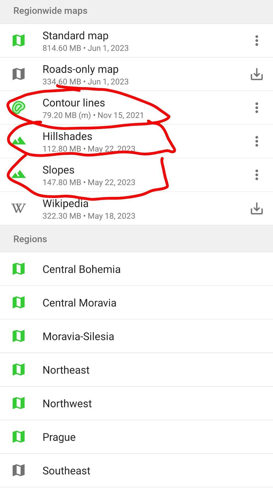
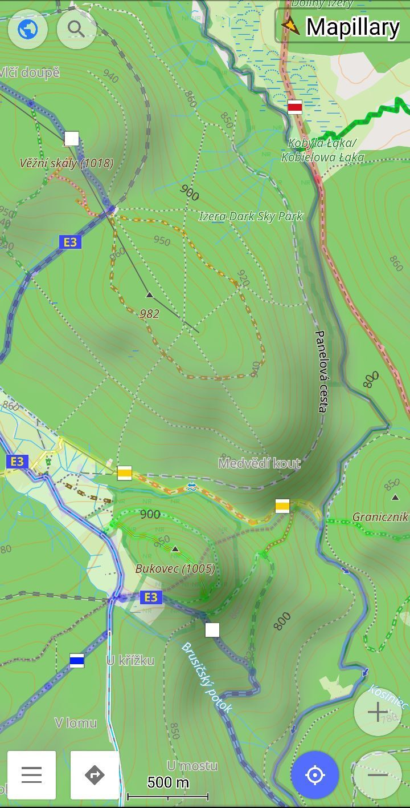
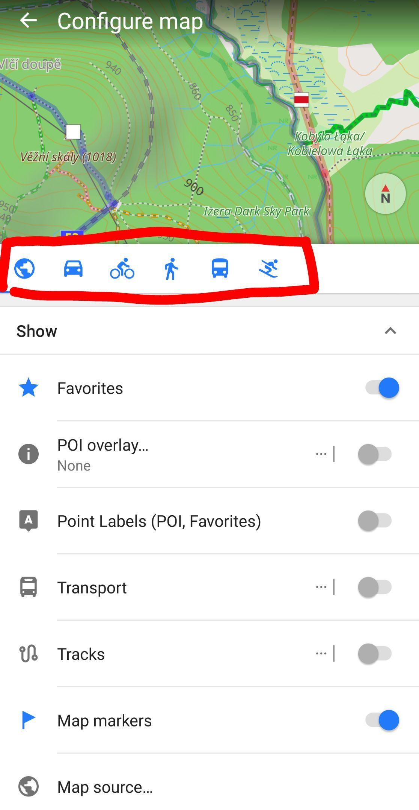
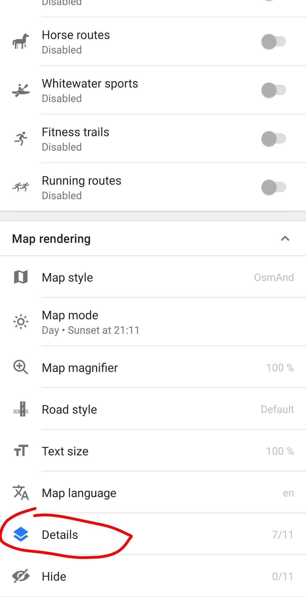
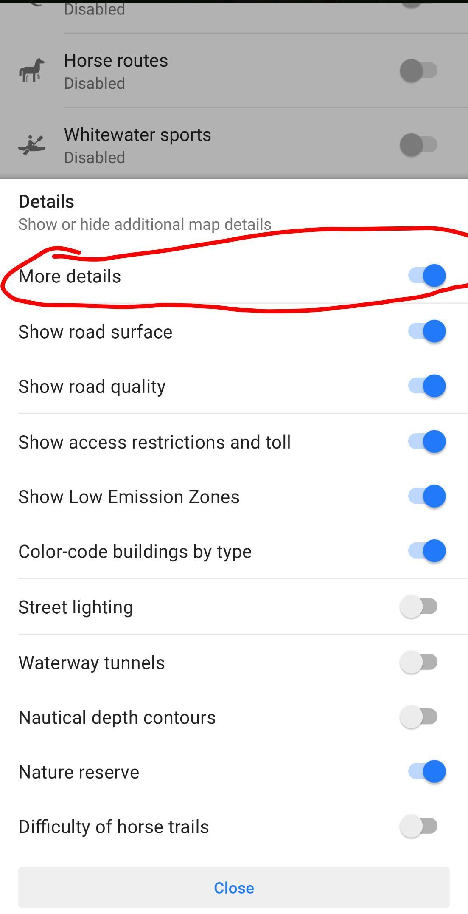

## OpenStretMaps: OsmAnda~

Start using OpenStreetMaps. The map is much better then GoogleMaps, I have GMaps only to check restaurant, which are not covered well on OpenStreetMaps.

1. Download osmand.net

2. It's local first app, so you have to download the map of the area. 

3. OsmAnd has a bit harder UI but there is so much features.

4. The important thing is to realize that you have multiple UI profiles (for car/war/bike/...). So you can set different level of detail to see and define for yourself what is relevant for you in given situation.

More tips in upcoming posts.

### Slopes & Contour Lines 

At OsmAnd you can (and should) download slopes, hillshades and contour lines.

You just go to Download Maps, then you select region and beside standart map you also download Contour lines, hillshades and slopes

   
   

## More Details

In OsmAnd it is very useful to display more details. I have it on for all profiles (walk/car/bike/browse).

You have to set this on for every profile you want this.

Go to Configure map → Select profile you want to edit → scroll all the way to the bottom → Details → Turn on the More details. 

You can also turn on some extra stuff there as well.

   
   
   

